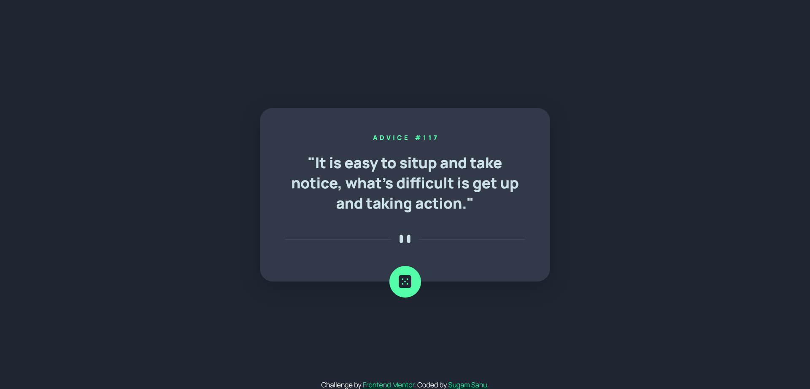
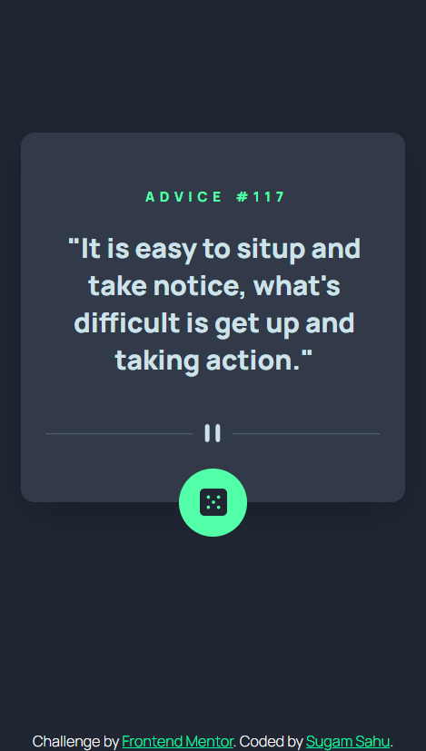

# 2nd Challenge - Frontend Mentor
## Frontend Mentor - Advice generator app solution

This is a solution to the [Advice generator app challenge on Frontend Mentor](https://www.frontendmentor.io/challenges/advice-generator-app-QdUG-13db). Frontend Mentor challenges help you improve your coding skills by building realistic projects.

### The challenge

Users should be able to:

- View the optimal layout for the app depending on their device's screen size
- See hover states for all interactive elements on the page
- Generate a new piece of advice by clicking the dice icon

## Screenshot

#### Challenge Screenshots

#### Solution Screenshots

### Links

- Solution URL: [GitHub Repo](https://github.com/iSugam/frontend-mentor-advice-generator)
- Live Site URL: [Live Site](https://isugam.github.io/frontend-mentor-advice-generator/)

## My process

### Built with

- Semantic HTML5 markup
- CSS custom properties
- Flexbox
- CSS Grid
- JavaScript
- Fetch API

### Continued development

As it's still not pixel perfect, I am still going to develop till I can create pixel perfect websites just from some screenshots.

## Author

- Website - [Sugam Sahu](https://www.sugamsahu.com)
- Frontend Mentor - [@iSugam](https://www.frontendmentor.io/profile/iSugam)
- LinkedIn - [sugam-sahu](https://www.linkedin.com/in/sugam-sahu/)
